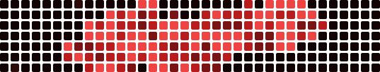

# Hello there, I'm Sergio 
📍 London

Deep in vibe-coding mode

## Current Projects

- 📝 <a href="https://github.com/sergiopesch/Note-Taker"><b>note-taker</b></a> — Talk, ramble, get tidy notes and next steps
- ☕️ <a href="https://github.com/sergiopesch/Fuse--Creatine-"><b>fuse--creatine-</b></a> — Creatine for coffee: performance upgrade without gritty regret
- 🤖 <a href="https://github.com/sergiopesch/robot-rave-"><b>robot-rave-</b></a> — A dancing robot built at a London hackathon
- 🔳 <a href="https://github.com/sergiopesch/qr-code-generator"><b>qr-code-generator</b></a> — Turns links into squares your camera actually understands
- 🎧 <a href="https://github.com/sergiopesch/Spotify-Notetaker"><b>spotify-notetaker</b></a> — Notes for podcasts: because rewind is emotional damage
- 🥐 <a href="https://github.com/sergiopesch/breakfast-burst-planner"><b>breakfast-burst-planner</b></a> — Plans breakfast so you can oversleep professionally
- 📚 <a href="https://github.com/sergiopesch/ai-research-gather"><b>ai-research-gather</b></a> — Research papers, summarized, so you can pretend you read them
- 🎛️ <a href="https://github.com/sergiopesch/my-audio-visualizer"><b>my-audio-visualizer</b></a> — Pixels dance to sound: nightclub for your speakers
- 🥋 <a href="https://github.com/sergiopesch/mybjjmentor"><b>mybjjmentor</b></a> — BJJ training tracker: less guessing, more choking politely
- 🚌 <a href="https://github.com/sergiopesch/mum-daughter-bus-checker"><b>mum-daughter-bus-checker</b></a> — London buses, school runs, fewer arguments before 8am please
- 🛍️ <a href="https://github.com/sergiopesch/london-shop"><b>london-shop</b></a> — Fake merch store, real love for London
- 🎙️ <a href="https://github.com/sergiopesch/virtualpodcaststudio"><b>virtualpodcaststudio</b></a> — Generates podcasts from the internet: chaos, but narrated
- 🏓 <a href="https://github.com/sergiopesch/ponglearn"><b>ponglearn</b></a> — Pong, but educational-ish
- 🎨 <a href="https://github.com/sergiopesch/designer-portfolio"><b>designer-portfolio</b></a> — A portfolio that roasts design culture while applying anyway lol
- 🧪 <a href="https://github.com/sergiopesch/aimc"><b>aimc</b></a> — AIMC: experiments, half-baked ideas, fully committed commits
- 🎬 <a href="https://github.com/sergiopesch/video-meme"><b>video-meme</b></a> — Make videos meme-ready: add captions, punchlines, chaos
- 🗣️ <a href="https://github.com/sergiopesch/VoiceModeReplica"><b>voicemodereplica</b></a> — Recreating voice mode vibes: talking to code, again
- 🧱 <a href="https://github.com/sergiopesch/verticalbrick-pong-game"><b>verticalbrick-pong-game</b></a> — Vertical pong bricks: frustration training disguised as fun
- 🔊 <a href="https://github.com/sergiopesch/voice"><b>voice</b></a> — Voice stuff: talk in, magic out, occasionally haunted
- 👥 <a href="https://github.com/sergiopesch/diarization-demo"><b>diarization-demo</b></a> — Speaker diarization demo: who said what, now

20 repos

## Vibe Activity

Parody heatmap. Not real contributions. Crab-coded.

