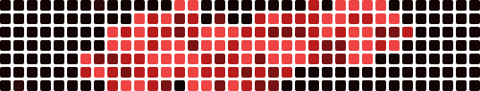

# Hello there, I'm Sergio 
📍 London, UK

## Active Projects

Focus learning

- 🐾 <a href="https://github.com/sergiopesch/animal360"><b>animal360</b></a> — "A Salesforce application for animal welfare organisations"
- 🗣️ <a href="https://github.com/sergiopesch/voco"><b>voco</b></a> — "A Linux voice-native interface layer designed for speed and precision"

## Vibe Coded Projects

Just for fun

- 🥧 <a href="https://github.com/sergiopesch/raspberry-pi-maker"><b>raspberry-pi-maker</b></a> — Pi projects, maker vibes
- 🔌 <a href="https://github.com/sergiopesch/arduino-maker"><b>arduino-maker</b></a> — Arduino hacks and builds
- ☕️ <a href="https://github.com/sergiopesch/Fuse--Creatine-"><b>fuse--creatine-</b></a> — Creatine meets coffee
- 🎧 <a href="https://github.com/sergiopesch/Spotify-Notetaker"><b>spotify-notetaker</b></a> — Notes for podcasts
- 🤖 <a href="https://github.com/sergiopesch/robot-rave-"><b>robot-rave-</b></a> — Dancing robot
- 🎨 <a href="https://github.com/sergiopesch/designer-portfolio"><b>designer-portfolio</b></a> — Portfolio that roasts design culture
- 🥐 <a href="https://github.com/sergiopesch/breakfast-burst-planner"><b>breakfast-burst-planner</b></a> — Plans breakfast
- 🛍️ <a href="https://github.com/sergiopesch/london-shop"><b>london-shop</b></a> — Fake merch, real London love
- 🧱 <a href="https://github.com/sergiopesch/verticalbrick-pong-game"><b>verticalbrick-pong-game</b></a> — Vertical pong
- 👥 <a href="https://github.com/sergiopesch/diarization-demo"><b>diarization-demo</b></a> — Who said what
- 📅 <a href="https://github.com/sergiopesch/month-match-adventure"><b>month-match-adventure</b></a> — Match months
- 🎛️ <a href="https://github.com/sergiopesch/my-audio-visualizer"><b>my-audio-visualizer</b></a> — Sound → pixels
- 🚌 <a href="https://github.com/sergiopesch/mum-daughter-bus-checker"><b>mum-daughter-bus-checker</b></a> — London buses
- 🔳 <a href="https://github.com/sergiopesch/qr-code-generator"><b>qr-code-generator</b></a> — Links → scannable squares
- 📝 <a href="https://github.com/sergiopesch/Note-Taker"><b>note-taker</b></a> — Talk, ramble, get notes

## Archived Projects

Saved for later
- ⚡ <a href="https://github.com/sergiopesch/voltz"><b>voltz</b></a> — "Voice-first AI companion for electronics enthusiasts"
- 🔧 <a href="https://github.com/sergiopesch/clitronic"><b>clitronic</b></a> — "A tool for electronic enthusiasts "
- 🎵 <a href="https://github.com/sergiopesch/mp3"><b>mp3</b></a> — Paste URL, get audio
- 🏓 <a href="https://github.com/sergiopesch/ponglearn"><b>ponglearn</b></a> — Pong, but it teaches stuff
- 🎙️ <a href="https://github.com/sergiopesch/virtualpodcaststudio"><b>virtualpodcaststudio</b></a> — Generates podcasts from the web
- 📚 <a href="https://github.com/sergiopesch/ai-research-gather"><b>ai-research-gather</b></a> — Papers summarized
- 🥋 <a href="https://github.com/sergiopesch/mybjjmentor"><b>mybjjmentor</b></a> — BJJ tracker
- 🎬 <a href="https://github.com/sergiopesch/video-meme"><b>video-meme</b></a> — Videos → memes
- 💡 <a href="https://github.com/sergiopesch/masterjj-initial-idea"><b>masterjj-initial-idea</b></a> — BJJ concept
- 📊 <a href="https://github.com/sergiopesch/pod-visualizer"><b>pod-visualizer</b></a> — Podcast visuals
- 🏋️ <a href="https://github.com/sergiopesch/kettlebellform"><b>kettlebellform</b></a> — Kettlebell form checker
- 📆 <a href="https://github.com/sergiopesch/weekly"><b>weekly</b></a> — Weekly planner thing
- 🌐 <a href="https://github.com/sergiopesch/my-site-template"><b>my-site-template</b></a> — Site template
- 🌱 <a href="https://github.com/sergiopesch/plant-watering-system"><b>plant-watering-system</b></a> — Waters plants

31 repos

## Vibe Activity

Parody heatmap. Not real contributions. Crab-coded.

